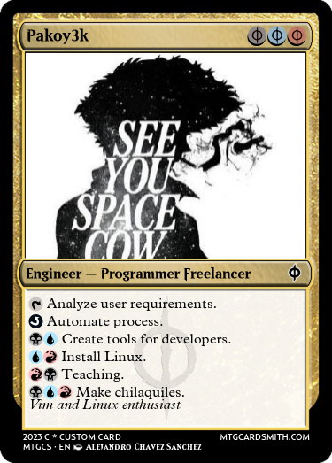

## Hello World 👋 It's [pakoy3k!](https://pakoy3k.com)
Software developer.

 

 

 

## What i'm up to

- 👯 Problem solver and critical thinking skill.
- Vim enthusiast
- 🤔 I like solve problems, automate process, create tools for developers and teach people technology.
- 💬 If your want to contact me yo can pakoy3k@gmail.com
- ⚡ MTG player

 
